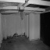

# Face-detection-example

# 📸 Custom Low-Res Face Detection Dataset

# 📖 Intro

I built this dataset as part of my “Neural Network on FPGA” project to test whether ultra-low-resolution data could still power complex deep learning tasks.

The focus on 64×64 grayscale images was intentional:

🏎️ Ultra-low resolution means very little data to compute → perfect for fast FPGA inference.

🎥 Enables high framerates, where the FPGA can process every frame in real time (outperforming software).

🧮 Puts quantisation-aware training and the FPGA hardware to the test — can they still handle complex, noisy tasks at scale?

To make the dataset genuinely usable for low-res face detection, I prioritised real-world robustness over “lab conditions.” That meant building in variation across:

😀 Expressions

👶🧓 Ages

🌍 Ethnicities

💡 Lighting

📐 Angles

🏠 Backgrounds

This way, the network would learn to detect faces themselves — not just a simple cue like a plain white background.

# 🖼️ Example Images

# ✨ Key Features

👥 Face Images from Genki4k

~4000 face images across different people

Variation in lighting, angles, backgrounds, and expressions

Originally for smile/no-smile classification so has varied expressions

🏠 Complex Background Negatives from MIT Indoor67

~4200 background images without faces

Includes offices, kitchens, bedrooms, corridors, etc.

Captures natural variation in lighting, perspective, and clutter

⚖️ Balanced Dataset

Even split: ~4000 face images vs. ~4200 non-face images (~5% difference)

Prevents bias toward always predicting “face” or “no-face” just from distribution of cases in data

Ensures model focuses on learning actual face features instead of background simplicity

💻 Data Processing Scripts & WSL Workflow

 - Used Python & shell scripts to resize, grayscale, and combine the face and background datasets into a unified 64×64 format.

 - Converted the processed images into CSV files for easy ingestion by Python training scripts.

 - Used Windows Subsystem for Linux (WSL) to efficiently manage large-scale file operations and batch processing across thousands of images.

 ## 📊 Results

- **Accuracy:** Achieved **88% accuracy** on this data after training (12-bit fixed-point, Q3.9 format).  
- **Robustness:** The custom dataset with meant strong generalization across **lighting conditions, head angles, facial expressions, ethnicities, and varied backgrounds**.  
- **Latency & Performance:**  
  - Critical path: **12.5 ns** (max clk - 80MHz) 
  - Inference latency: **775ns** (72 cycles at 80 MHz)  
- **FPGA Resource Utilization (Artix-7 100T):**  
  - LUTs: **28k** (≈45% of device)  
  - DSPs: **184** (≈76% of device)  
- **Synthesis:** The design was fully synthesizable in Vivado, meeting **timing constraints** and **pin assignments** without exceeding resource limits.

 ✅ These results demonstrate that the framework enables **ultra-low-latency neural network inference** on a mid-range FPGA, balancing **accuracy, speed, and resource utilization**, and is fully configurable for a **range of different tasks** beyond MNIST and into deep neural nets.

